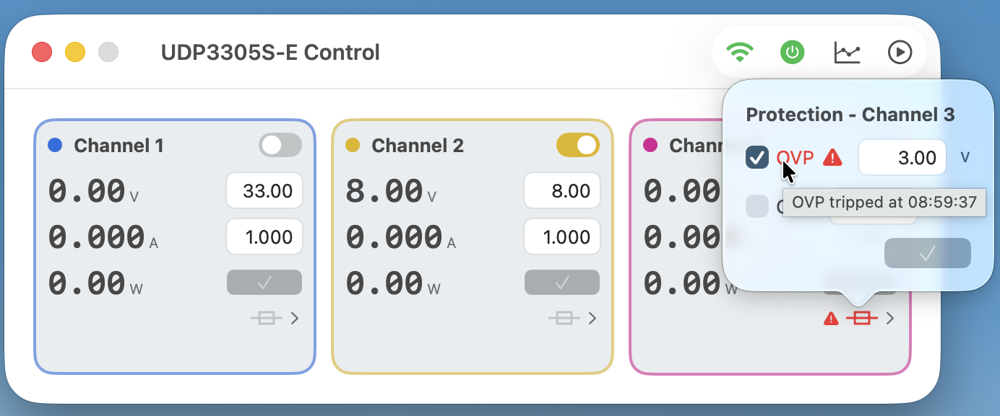

# UDP3000S Control

A native macOS (SwiftUI) app for remote-controlling UNI-T UDP3000S-series
programmable DC lab power supplies over the network — no cloud, no account. 
It talks directly to the device's own SCPI socket on your
local network.





> Built with AI for my own personal use with a specific device on hand, so I
> likely won't be putting much time into it — no promised support or
> roadmap. That said, you're very welcome to copy, use, and modify it for
> your own setup; see [License](#license) below.

## What it does

- Live voltage / current / power readouts per channel, refreshed a few
  times a second
- Voltage and current setpoint control, with dirty-state indication before
  you apply a change
- Over-voltage / over-current protection (OVP/OCP) configuration, with a
  trip indicator: if OVP or OCP actually cuts the output, the channel's fuse
  icon turns red with a warning mark (and the specific OVP/OCP label in its
  protection popover does too), showing which protection tripped and when.
  This uses an undocumented per-channel status register (see caveats below)
  rather than anything in UNI-T's published manual, so it's confirmed
  working on this unit's firmware but not guaranteed elsewhere. The
  indicator clears the moment you turn that channel's output back on or
  apply a setpoint/protection change
- One-click "all outputs on/off", mirroring the device's own physical button
- A constant-voltage/constant-current (CV/CC) indicator, read directly from
  the device rather than inferred
- Energy (Wh) and charge (mAh) tracking per output cycle, on supported
  firmware (see caveats below) — tap the wattage readout to cycle
  W → Wh → mAh
- Series/parallel mode detection (CH1+CH2 combined), with an on-screen
  warning banner — the app only *detects and displays* this mode, it can't
  switch the device into SER/PARA itself. That has to be done on the
  device's own front panel, since combining channels requires physically
  rewiring the output terminals first, and only you can confirm the wiring
  is actually correct for the mode you're about to enable
- A live graphing window (voltage and current over time) with CSV export
- A playback feature: load a CSV of setpoints and have the app apply them
  automatically at the recorded times, e.g. to replay a test sequence
- Localized into English, German, Spanish, Catalan, French, European
  Portuguese, Brazilian Portuguese, Dutch, Italian, Polish, Czech, Danish,
  Swedish, Norwegian (Bokmål), Finnish, Chinese (Simplified), Japanese, and
  Korean

## Supported devices and important caveats

This was built and tested against a **UNI-T UDP3305S-E**. The UDP3000S
series also includes the **UDP3305S** (no suffix) and **UDP3305S-U**, which
share the same SCPI command set but are **not both directly tested** —
please treat the following as best-effort based on UNI-T's documentation
and vendor-confirmed differences, not first-hand verification on every
variant:

- **Model detection**: on connect, the app queries `*IDN?` and uses the
  reported model string to decide how many decimal places to show/accept
  for voltage and current. The bare **UDP3305S** reports one extra decimal
  of resolution compared to the **-E**/**-U** variants (e.g. `12.345 V`
  instead of `12.34 V`). If the model can't be identified yet, the app
  defaults to the -E/-U precision.
- **Firmware-gated features**: the Wh/mAh energy and charge tracking uses
  two SCPI queries (`MEASURE:ENERGY?` / `MEASURE:CAPACITY?`) that are
  **undocumented** in UNI-T's official programming manual and only exist
  from **firmware 1.17 onward** — older units simply don't respond to them.
  The app checks the reported firmware version and only enables the
  Wh/mAh view when it's 1.17 or later; on older firmware the wattage
  readout just stays on W. These two accumulators are also per-on-cycle
  counters, not lifetime totals — the device itself resets them to 0 the
  instant an output turns off.
- **OVP/OCP trip detection**: also undocumented. The device's main
  `STATus:QUEStionable?`/`:CONDition?` registers never actually reflect a
  protection trip on this firmware — they read `0` even immediately after
  one — and the *live* per-channel condition register clears again within
  ~150ms of the output settling off, too fast to poll reliably. The one
  register that does work is the **latched** per-channel event register,
  `STATus:QUEStionable:INSTrument:ISUMmary<n>:EVENt?` (bit 2 = OVP tripped,
  bit 3 = OCP tripped) — confirmed by deliberately tripping each protection
  on real hardware and reading it back a full second later. `SER`/`PARA`
  combined-channel mode falls back to channel 1's summary register, since
  that's the "master" side of the pair — this mapping is untested on real
  hardware in that mode.
- If you try this against a different UNI-T model entirely and something
  doesn't work, it's very likely a SCPI response format difference the app
  doesn't yet account for — issues/PRs welcome.

## Requirements

- macOS 14 (Sonoma) or later
- **The power supply must be reachable on your local network** — this app
  connects directly to the device's raw SCPI-over-TCP socket on **port
  5025**, with no authentication (matching the device's own behavior; this
  isn't an app-level security tradeoff). It does not work over the
  internet, through NAT, or if the device and your Mac are on different,
  unbridged subnets/VLANs. Enable the device's LAN interface and note its
  IP address (device menu, or your router's DHCP client list) before
  connecting.

## How graphing works

The graph window (toolbar icon, or opened as a separate window so it can
stay up alongside the main window) records live readings while it's
running:

1. Click **Start** to begin recording. Every reading the app receives
   while polling the device is added to that channel's series (voltage and
   current, each against elapsed time in seconds since you clicked Start).
2. Two charts are shown — voltage and current — both sharing the same time
   axis. Click a channel's legend entry (e.g. "CH1 V") to show/hide that
   specific series without losing the recorded data.
3. Click **Stop** to pause recording (data is kept; **Start** again to
   resume as a continuation, or **Clear** to discard everything).
4. **Export CSV…** saves everything recorded so far. To keep the file
   small, consecutive samples are only written when voltage, current, or
   output state actually *changed* — the exported file is a sparse
   change-log, not a fixed-interval time series, though every point remembers
   the time it happened at.

The exported CSV uses the same column format the playback feature reads
back in (see below), so a graph recording can be re-loaded directly as a
playback script.

## CSV format for playback

Load a CSV via the playback popover's **Choose CSV…** button. Required
columns (by header name, any order):

| Column       | Meaning                                    |
|--------------|---------------------------------------------|
| `channel`    | `CH1` / `CH2` / `CH3` / `SER` / `PARA`      |
| `time_s`     | When to apply this row, in seconds from the start of playback |
| `voltage_v`  | Voltage setpoint to apply                   |
| `current_a`  | Current setpoint to apply                   |

An optional `output_on` column (`true`/`false` or `1`/`0`) also turns that
channel's output on or off at the same time. If the column is missing
entirely, playback only touches setpoints and leaves outputs alone.

The format is the same for recording and playback so you can reuse a CSV saved
from the graph feature to build a sequence for playback. Just remember to adjust
the values, especially for current.

Example:

```csv
channel,time_s,voltage_v,current_a,output_on
CH1,0,0.00,0,FALSE
CH2,0,0.00,0,FALSE
CH1,4,20,1,TRUE
CH2,4,10,2,TRUE
CH1,15,20,0.1,FALSE
CH2,15,30,0.1,FALSE
```

Rows are sorted by `time_s` and then applied at their relative offset from
the first row's time — playback doesn't care what absolute values `time_s`
starts at, only the differences between rows.

**Delimiter**: both comma- and semicolon-delimited files are accepted
(auto-detected from whichever separator is more common in the header row),
to play nicely with spreadsheet apps in locales that use `;` as the field
separator. **However**, numeric values themselves must still use a period
as the decimal point (`12.5`, not `12,5`) regardless of which delimiter is
used — a semicolon-delimited file with comma decimals (common from some
European-locale spreadsheet exports) will silently read those cells as
`0`. If in doubt, open the CSV in a plain text editor and check.

## Installing the pre-built app (unsigned binary)

This app is **ad-hoc signed** (`codesign --sign -`), not signed with a paid
Apple Developer ID or notarized — this is a personal/hobby tool, not a
distributed product. macOS Gatekeeper will therefore refuse to open it
normally the first time, usually with a dialog saying it "cannot be opened
because Apple cannot check it for malicious software" (wording varies by
macOS version). This is expected — here's how to get past it:

**Option A — System Settings (no Terminal needed):**
1. Try to open the app once (double-click it) — it'll be blocked.
2. Open **System Settings → Privacy & Security**, scroll down — you should
   see a note that the app was blocked, with an **Open Anyway** button.
   Click it.
3. Try opening the app again; confirm in the follow-up dialog (may ask for
   your password or Touch ID).

**Option B — Terminal (one command, faster):**
```sh
xattr -cr "/path/to/UDP3000S Control.app"
```
This clears the quarantine flag macOS attaches to anything downloaded from
the internet. After this, the app opens normally.

You only need to do this once per copy of the app.

## Building it yourself

No Xcode project or license required — this is a plain Swift Package
Manager executable, hand-wrapped into a `.app` bundle by a small script.

**Requirements**: macOS 14+, and the Xcode **Command Line Tools** (not the
full Xcode.app):
```sh
xcode-select --install
```

**Build and package:**
```sh
cd udp3000s-control
swift build -c release      # compiles the binary
./build_app.sh               # wraps it into UDP3000S Control.app
```

`build_app.sh` copies the compiled binary, the app icon, and all 18
localization bundles into a proper `Contents/…` app structure, writes an
`Info.plist`, and ad-hoc code-signs the result. The finished
`UDP3000S Control.app` appears in the `udp3000s-control/` directory — drag it to
`/Applications` if you'd like it there permanently. Since you signed it
yourself locally, you won't hit the Gatekeeper warning above for your own
build (quarantine is only attached to files that arrived via download,
AirDrop, etc., not ones compiled on your own machine).

To rebuild after making changes, just re-run both commands — `build_app.sh`
always does a fresh `swift build` itself, so a bare `./build_app.sh` is
enough for subsequent builds.

## License

[MIT](LICENSE) — do whatever you'd like with it: use it, fork it, rip out
the parts you want for your own project. No attribution required beyond
keeping the license file if you redistribute it.
